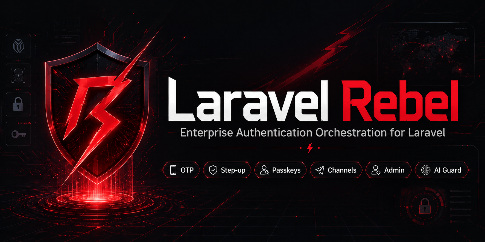

# Laravel Rebel — Recovery

> **Single-use recovery codes done right.** Backup codes the user can fall back to when they lose their device — generated once, stored only as keyed HMACs, verified in constant time, single-use, and easy to type. Part of the `padosoft/laravel-rebel-*` suite.

<p align="center">
  
</p>

<p align="center">
  
  
  
  
  
</p>

---

## Table of contents

- [What it is](#what-it-is)
- [Why this package](#why-this-package)
- [Rebel Recovery vs the alternatives](#rebel-recovery-vs-the-alternatives)
- [Installation](#installation)
- [Usage](#usage)
- [Security notes](#security-notes)
- [`.env.example`](#envexample)
- [Testing & License](#testing--license)

---

## What it is

High-assurance account-recovery building blocks for Rebel. v0.1.0 ships **recovery
(backup) codes**: a set of one-time codes a user can use to recover access. Pair them with a
high-assurance step-up purpose (from `laravel-rebel-step-up`) to gate sensitive recovery flows.

Depends on [`padosoft/laravel-rebel-core`](https://github.com/padosoft/laravel-rebel-core).

---

## Why this package

| ★ | What | In short |
|---|---|---|
| ★★★ | **Hashed at rest** | Codes are stored as a keyed HMAC of `(salt\|code)` with a `key_version` — never plaintext, pepper-rotation friendly. |
| ★★★ | **Single-use & atomic** | Verification locks the row and consumes the code; a code works exactly once. |
| ★★★ | **Constant-time verify** | All candidates are checked without early-exit, so timing doesn't leak which code matched. |
| ★★ | **Typo-tolerant** | Input is normalized (case, separators, Crockford O→0 / I·L→1), so a correct code never fails on format. |
| ★★ | **Regenerate safely** | Generating a new set invalidates all previous unconsumed codes. |
| ★★ | **Audited & multi-tenant** | Generate/complete/fail are recorded; rows are tenant-scoped. |

---

## Rebel Recovery vs the alternatives

| Capability | **Rebel Recovery** | Fortify recovery codes | Hand-rolled |
|---|:---:|:---:|:---:|
| Codes hashed at rest | ✅ | ➖ (encrypted blob) | ❌ |
| Keyed HMAC + key_version (pepper rotation) | ✅ | ❌ | ❌ |
| Constant-time verification | ✅ | ➖ | ❌ |
| Atomic single-use (row lock) | ✅ | ➖ | ❌ |
| Input normalization (typo-tolerant) | ✅ | ❌ | ❌ |
| ~100-bit entropy codes | ✅ | ➖ (~50 bits) | ➖ |
| Audited + multi-tenant | ✅ | ❌ | ❌ |

> Legend: ✅ built-in · ➖ partial · ❌ not available.

---

## Installation

```bash
composer require padosoft/laravel-rebel-recovery
php artisan vendor:publish --tag="rebel-recovery-migrations"
php artisan migrate
```

---

## Usage

```php
use Padosoft\Rebel\Recovery\RecoveryCodeManager;

$recovery = app(RecoveryCodeManager::class);

// At enrolment: generate and SHOW ONCE (cannot be retrieved again)
$codes = $recovery->generate($user, count: 10);
// → ["A1B2-C3D4-E5F6-G7H8-J9K0", ...]  display/download these now

// Later: the user submits one code to recover access
if ($recovery->verify($user, $request->string('code'))) {
    // consumed — let them through (ideally behind a high-assurance step-up)
}

$recovery->remaining($user); // how many codes are left
```

---

## Security notes

- **Never stored in plaintext**: only a keyed HMAC of `(salt|code)` with a `key_version`.
- **Single-use & atomic**: a row lock guarantees a code can be redeemed once.
- **Constant-time**: the whole candidate set is checked, no early-exit timing leak.
- **No built-in lockout**: recovery codes are a *lookup secret* — put your app's brute-force
  throttle in front of `verify()` (and treat repeated failures as an anti-ATO signal).
- **Multi-tenant**: rows are scoped via the core tenant scope — resolve the current tenant
  per request in multi-tenant deployments so codes never cross tenants.

---

## `.env.example`

```dotenv
REBEL_RECOVERY_CODE_COUNT=10
```

---

## Testing & License

```bash
composer test      # Pest (generate, single-use verify, reuse, regenerate, per-subject, normalization)
composer phpstan   # static analysis, level max
composer pint      # code style
```

**License:** MIT — see [LICENSE](LICENSE). Part of the [`padosoft/laravel-rebel`](https://github.com/padosoft) suite.
